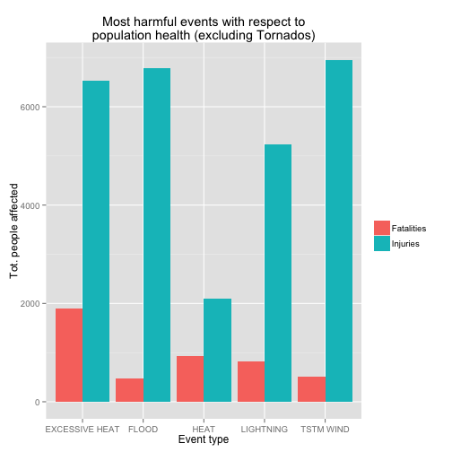

# Exploring the NOAA Storm Database 

## Synopsis

In this report we aim to identify which severe weather events are most harmful 
with respect to population health and economic in the USA. For this we 
obtained the U.S. National Oceanic and Atmospheric Administration's (NOAA) 
storm database, which tracks characteristics of major storms and weather 
events in the United States. Analyzing fatalities and injuries per event type, 
we identified the most harmful events besides Tornados. Also, the most 
economically harmful events were identified.

## Data processing

We first download the NOAA database as a csv file, and then load it into R:


```r
download.file('http://d396qusza40orc.cloudfront.net/repdata%2Fdata%2FStormData.csv.bz2', 
              'data/repdata-data-StormData.csv.bz2')
storm_data <- read.csv('data/repdata-data-StormData.csv.bz2')
```

Some packages will be used to transform and visualize the data:


```r
library(ggplot2)
library(dplyr)
library(tidyr)
storm_data <- tbl_df(storm_data)
```

First of all we take a look at the first observations:


```r
head(storm_data)
```

```
## Source: local data frame [6 x 37]
## 
##   STATE__           BGN_DATE BGN_TIME TIME_ZONE COUNTY COUNTYNAME STATE
## 1       1  4/18/1950 0:00:00     0130       CST     97     MOBILE    AL
## 2       1  4/18/1950 0:00:00     0145       CST      3    BALDWIN    AL
## 3       1  2/20/1951 0:00:00     1600       CST     57    FAYETTE    AL
## 4       1   6/8/1951 0:00:00     0900       CST     89    MADISON    AL
## 5       1 11/15/1951 0:00:00     1500       CST     43    CULLMAN    AL
## 6       1 11/15/1951 0:00:00     2000       CST     77 LAUDERDALE    AL
## Variables not shown: EVTYPE (fctr), BGN_RANGE (dbl), BGN_AZI (fctr),
##   BGN_LOCATI (fctr), END_DATE (fctr), END_TIME (fctr), COUNTY_END (dbl),
##   COUNTYENDN (lgl), END_RANGE (dbl), END_AZI (fctr), END_LOCATI (fctr),
##   LENGTH (dbl), WIDTH (dbl), F (int), MAG (dbl), FATALITIES (dbl),
##   INJURIES (dbl), PROPDMG (dbl), PROPDMGEXP (fctr), CROPDMG (dbl),
##   CROPDMGEXP (fctr), WFO (fctr), STATEOFFIC (fctr), ZONENAMES (fctr),
##   LATITUDE (dbl), LONGITUDE (dbl), LATITUDE_E (dbl), LONGITUDE_ (dbl),
##   REMARKS (fctr), REFNUM (dbl)
```

After being loaded we performed some summaries of the data, summing 
fatalities and injuries per event type, and also economic damage:


```r
grp_by_evtype <- group_by(storm_data, EVTYPE) %>% 
        summarise(tot.fatalities = sum(FATALITIES), 
                  tot.injuries = sum(INJURIES),
                  tot.harm = tot.fatalities + tot.injuries,
                  tot.propdmg = sum(PROPDMG),
                  tot.cropdmg = sum(CROPDMG),
                  tot.dmg = tot.propdmg + tot.cropdmg)
```

## Results

Ploting the 5 most harmful events, we can see that Tornados are, by far, the 
most harmful:


```r
top_people <- arrange(grp_by_evtype, desc(tot.injuries))[1:5, ]
people_long <- gather(top_people, 
               type, people, tot.fatalities, tot.injuries) %>% 
        select(EVTYPE, type, people)
ggplot(people_long, 
       aes(x = factor(EVTYPE), y = people, fill = factor(type))) + 
        stat_summary(fun.y = sum, position = position_dodge(), geom = 'bar') + 
        ggtitle('Most harmful events with respect to population health') + 
        labs(list(x = 'Event type', y = 'Tot. people affected')) + 
        scale_fill_discrete(name = '', labels = c('Fatalities', 'Injuries'))
```

 

Just so we can analize better the other events, we plot here the 5 most harmful
excluding Tornados:


```r
top_people_excl_tornado <- arrange(filter(grp_by_evtype, EVTYPE != 'TORNADO'), 
                                   desc(tot.injuries))[1:5, ]
people_long_excl_tornado <- gather(top_people_excl_tornado, 
                                   type, people, tot.fatalities, tot.injuries) %>% 
        select(EVTYPE, type, people)
ggplot(people_long_excl_tornado, 
       aes(x = factor(EVTYPE), y = people, fill = factor(type))) + 
        stat_summary(fun.y = sum, position = position_dodge(), geom = 'bar') + 
        ggtitle('Most harmful events with respect to\npopulation health (excluding Tornados)') + 
        labs(list(x = 'Event type', y = 'Tot. people affected')) + 
        scale_fill_discrete(name = '', labels = c('Fatalities', 'Injuries'))
```

 

Besides Tornados, we can see that Excessive heat, Floods, Lightning and 
Tstm wind are also very harmful for the population.

Watching for properties and crop damage, Tornados make also the most impact,
followed by Flash flood and Tstm Wind:


```r
top_dmg <- arrange(grp_by_evtype, desc(tot.propdmg))[1:5, ]
economic_long = gather(top_dmg, type, dmg, tot.propdmg, tot.cropdmg) %>%
        select(EVTYPE, type, dmg)
ggplot(economic_long, 
       aes(x = factor(EVTYPE), y = dmg, fill = factor(type))) + 
        stat_summary(fun.y = sum, position = position_dodge(), geom = 'bar') + 
        ggtitle('Events with greatest economic consequences') + 
        labs(list(x = 'Event type', y = 'Damage in dollars')) + 
        scale_fill_discrete(name = '', labels = c('Properties', 'Crop'))
```

 
